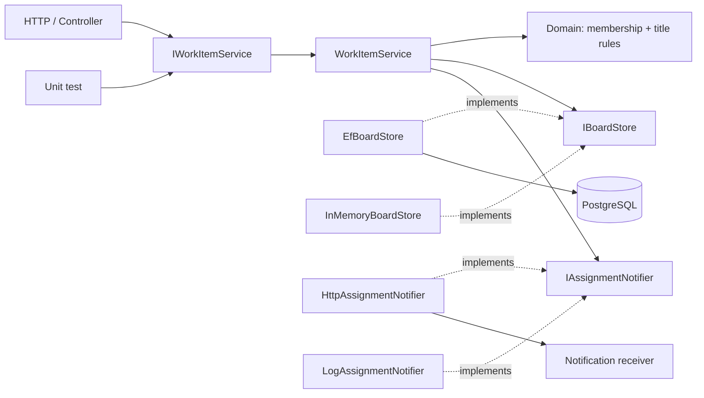
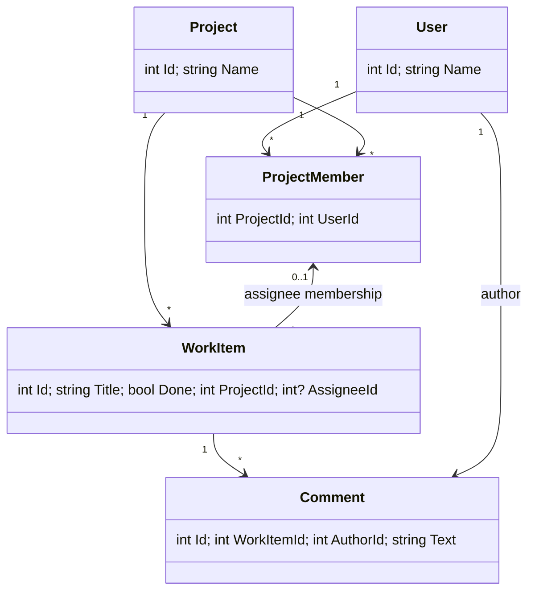

# TeamBoard · الهيكل السداسي

القلب = Domain + Application. المدخلان في هذا المشروع هما HTTP والاختبار. الأطراف الخارجة هي التخزين والإشعار. لا تعني «سداسي» أن لدينا ست طبقات.

## UML النموذج

## أكمل الرسم قبل قراءة implementation

1. لماذا لا يكفي foreign key من AssigneeId إلى User.Id وحده؟
2. من يملك IBoardStore: القلب أم EF adapter؟
3. ارسم ProjectReference من Infrastructure. هل هو نفس اتجاه نداء use case وقت التشغيل؟

الإجابات للمقارنة: FK المركب إلى ProjectMember يحمي الانتماء لنفس المشروع؛ المنفذ يملكه Application؛ Infrastructure يعتمد Application مع أن Application ينادي implementation وقت التشغيل عبر العقد.

## حدود مقصودة

- IBoardStore منفذ خاص بحاجات هذا التطبيق، وليس generic repository.
- بعض نماذج domain هنا بيانات بسيطة؛ لا نزعم أنها DDD كاملة.
- لا IQueryable ولا DbContext ولا HttpContext في Application.
- Program.cs يعرف adapters لأنه composition root. Controllers لا تستورد EF.
- الحفظ يسبق الإشعار. الإشعار best effort؛ فشله لا يتراجع عن الحفظ. لا outbox أو تسليم مضمون في هذه الرحلة.
- اختبار test authentication يختبر الصلاحية، ولا يثبت JWT signature validation.
- SQLite في الاختبارات لا يغني عن PostgreSQL عندما نختبر provider أو migrations.
